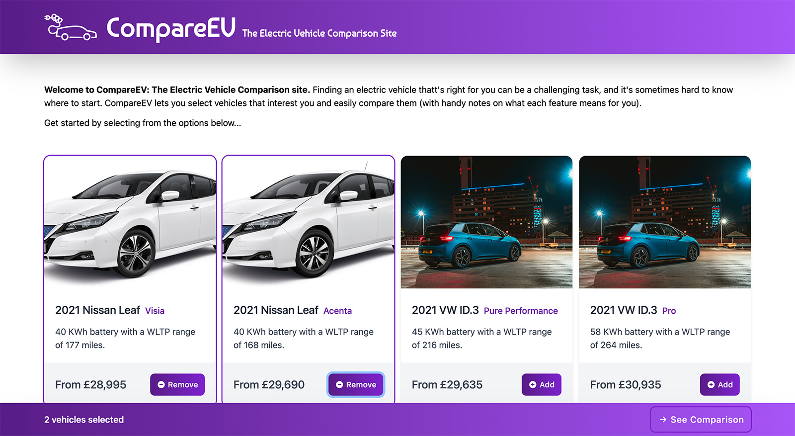

# CompareEV - Electric Vehicle Comparison App

The purpose of CompareEV is to provide a simple comparison website for those wishing to purchase an Electric Vehicle (EV). Users will be able to select vehicles that interest them and be presented with an annotated comparison table.

## Contributions Welcome

If you would like to contribute, or have any questions, please [feel free to raise an issue](https://github.com/tomgiddings/compare-EV/issues) or create a Pull Request.

If you would like to request an update to vehicle data, you can [submit your update here](https://github.com/tomgiddings/compare-EV/issues/new?assignees=tomgiddings&labels=data-update&template=request-vehicle-data-update.md).

## Screenshots



## Tech Used

Part of the reason for creating this application is to experiment with and learn technologies (namely GraphQL and MongoDB Atlas/Realm):

- UI: [Next.js](https://nextjs.org)
- CSS: [Tailwind](https://tailwindcss.com)
- DB: [MongoDB Atlas](https://www.mongodb.com/atlas/database)
- API: [MongoDB Realm](https://www.mongodb.com/realm)
- Query: [GraphQL](https://graphql.org)

## Live Version/Demo

A live version can be found at https://compareEV.uk.

## Getting Started

1. Install dependencies:

```bash
npm i
```

2. Launch app:

```bash
npm run dev
```

3. Visit [http://localhost:3000](http://localhost:3000) with your browser.

## API Setup

This app has been granted read-only access to the database using MongoDB Realm, and is pre-configured for anonymous access. No further configuration is required.

## Deploy on Vercel

The easiest way to deploy this app is to use the [Vercel Platform](https://vercel.com/new?utm_medium=default-template&filter=next.js&utm_source=create-next-app&utm_campaign=create-next-app-readme) from the creators of Next.js.

## License

This project is licensed under the [GNU General Public License v3.0](https://github.com/tomgiddings/compare-EV/blob/main/LICENSE).

